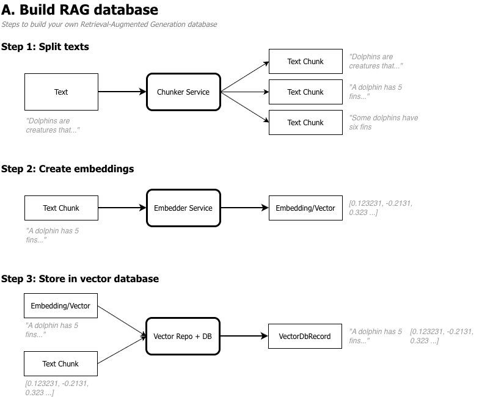
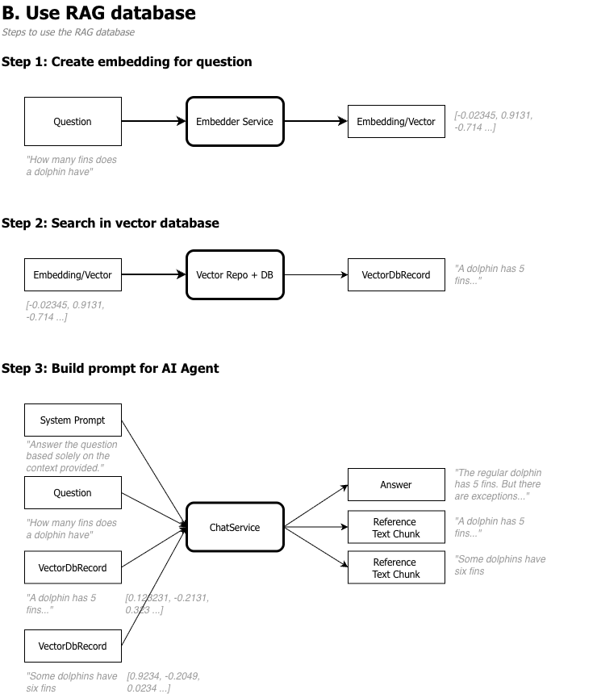

# Creating a custom RAG

## What is RAG? (In simple terms)

**RAG** stands for **Retrieval-Augmented Generation**. It’s a smart technique that makes AI assistants much more accurate and up-to-date.

Imagine an AI working *without* RAG: it only answers based on what it “learned” during training. That information can be outdated, incorrect, or incomplete.

**With RAG, here’s how it works:**
1. **Retrieval:** When you ask a question, the AI first searches trusted sources (like internal documents, recent news articles, or a knowledge base) for relevant information.
2. **Augmentation:** Those found text snippets are directly added to your original question/prompt.
3. **Generation:** The AI uses both its own training knowledge and the *correct* information from the source to craft an accurate answer.

### Why is this useful?
- **Up-to-date:** Connects to recent data without needing to retrain the AI.
- **More accurate:** Fewer “made-up” answers (hallucinations), since the AI sticks to the retrieved facts.
- **Secure & private:** You can connect the AI to internal company documents without exposing that data publicly.
- **Verifiable:** The AI can often cite sources, so you can check where the answer came from.

### 🛠️ Where is it used?
Customer service (answering based on manuals), research assistants, legal/medical document analysis, and any system where accurate, up-to-date information is crucial.

In short: **RAG gives the AI a “trusted source” to look up, so it answers smarter and more reliably.**

## Why this project?
I want to learn the inner workings of a RAG. So I made my own RAG in a few hours/days. It was fun and I learned a lot. 

## How it is build?
Below you will find an overview of how implemented this custom RAG. There are several steps. I described it in the order I build this project:

1. **Determine supported document types** - Determine what kind of documents to use. I decided to use markdown because it is a common standard with a basic understandable structure
2. **Create a text chunker** - To make the RAG work, larger texts must be split up in smaller parts. There are several methodologies. I used methodology 1 and 2 from [this document](./chunking/chunking-methodologies.md). This is implemented in [MarkDownChunkerService](../code/services/chunker/markdown_chunker_service.py)
3. **Token count** - Text chunks must be limited to a specific size, between 300-500 tokens. However, tokens are not the same as characters. We need to determine the token size of a text. In other words convert a number of characters to a number of tokens. This is done in the token_counter service ([TokenCounterSimple](../code/services/token_counter/token_counter_simple.py), [TokenCounterTikToken](../code/services/token_counter/token_counter_tiktoken.py)). Which of the 2 is used is determined in the [Dependencies](../code/dependencies.py), change it there.
4. **Create embeddings** - An embedding is a vector: an array of float values. With the chunked texts we are ready to create an embedding for each chunk. Embeddings are created with an embedding AI model. We put in text and the output is an array of floats. For this step a host is needed for creating the embeddings. This can be done using a local Ollama or LM Studio. See the configuration section below. The service [NomicEmbeddingService](../code/services/embeddings_creator/nomic_embedding_service.py) is responsible for creating embeddings from text.
5. **Create a vector db and repository** - The embeddings must be stored together with the related texts in a data store, a vector database. An in-memory vector [db](../code/services//vector_db/in_memory_vector_db.py) and [repository](../code/services/vector_repository/nomic_embed_vector_repository.py) is part of the solution. The `add` method makes it possible to add new embeddings. The `search` method implements the essential cosine similarity search. We use `numpy`. The repository is implemented as a wrapper because for nomic embed it is important to prefix documents with `document_search: ` and when a search is performed, the prefix: `document_query: ` must be added. Now, without the next steps you can perform a perfect similarity search and find text chunks that are related to a given question.
6. **Chat Service** - We need a service that answer questions and take the stored documents in account. This service will use an Large Language Model

### Build a RAG


### Use a RAG


## How to use?

1. Install LM Studio. 
   You can also use ollama but that needs some extra configuration
2. Download `text-embedding-nomic-embed-text-v1.5` model in LM Studio
   This model is used to create embeddings. If you want to use a different model, change it in the [NomicEmbeddingService](../code/services/embeddings_creator/nomic_embedding_service.py)
3. Download a regular model to use for the chat. 
   Currently `qwen3.6-35b-a3b-mlx` is configured in the [LocalLmStudioChatService](../code/services/chat/local_lmstudio_chat_service.py). If you select a different model, change it in the `init` method of this service.
4. Run `pip install -r requirements.txt` from the `code` directory
5. Run [main.py](../code/main.py)

**Sample result:**
```
[Creating Text Chunks]
['This text fragment is part of "BrewMate", sectie: BrewMate Mini – Productinformatie, sub-section: Over het apparaat. De BrewMate Mini is een compacte espressomachine, ontworpen voor gebruik in kleine keukens en studentenkamers. \nHet apparaat weegt slechts 1,8 kilogram en heeft een waterreservoir van 0,6 liter, genoeg voor twee tot drie \nkopjes espresso zonder bijvullen.', 'This text fragment is part of "BrewMate", sectie: BrewMate Mini – Productinformatie, sub-section: Werking. De machine werkt met een pompdruk van 15 bar en bereikt de ideale zettemperatuur binnen ongeveer 25 seconden na het \ninschakelen. Dankzij het compacte formaat past de BrewMate Mini eenvoudig op een smal aanrecht, en het lichtgewicht \nontwerp maakt het apparaat ook geschikt om mee te nemen op reis of naar kantoor.', 'This text fragment is part of "BrewMate", sectie: BrewMate Mini – Productinformatie, sub-section: Kleuren en prijs. BrewMate Home levert de Mini standaard in de kleur mat zwart, al is er ook een witte uitvoering verkrijgbaar tegen\neen kleine meerprijs. De adviesprijs bedraagt 79,95 euro.', 'This text fragment is part of "BrewMate", sectie: BrewMate Mini – Productinformatie, sub-section: Garantie. Op het apparaat zit een garantie van één jaar, geldig vanaf de aankoopdatum bij een erkende verkoper.']
[Sample Embedding]
[-0.0009645704994909465, 0.035120341926813126, ...]
Added 4 items to vector repository
[Vector Search: Kleur]
['search_document: This text fragment is part of "BrewMate", sectie: BrewMate Mini – Productinformatie, sub-section: Kleuren en prijs. BrewMate Home levert de Mini standaard in de kleur mat zwart, al is er ook een witte uitvoering verkrijgbaar tegen\neen kleine meerprijs. De adviesprijs bedraagt 79,95 euro.']
[Vector Search: Pompdruk]
['search_document: This text fragment is part of "BrewMate", sectie: BrewMate Mini – Productinformatie, sub-section: Werking. De machine werkt met een pompdruk van 15 bar en bereikt de ideale zettemperatuur binnen ongeveer 25 seconden na het \ninschakelen. Dankzij het compacte formaat past de BrewMate Mini eenvoudig op een smal aanrecht, en het lichtgewicht \nontwerp maakt het apparaat ook geschikt om mee te nemen op reis of naar kantoor.']
[Full Chat Result: Kleur]
Please be patient, LLM is running...
Here's a thinking process:

1.  **Analyze User Input:**
   - **Question:** "In welke kleur is de brewmate mini te verkrijgen?" (In which color is the BrewMate Mini available?)
   - **Context:** Two search documents provided.
     - Doc 1: Mentions colors and price. "BrewMate Home levert de Mini standaard in de kleur mat zwart, al is er ook een witte uitvoering verkrijgbaar tegen een kleine meerprijs." (BrewMate Home delivers the Mini standard in matte black, but a white version is also available for a small extra fee.)
     - Doc 2: Mentions operation, pressure, temperature, size, weight. Irrelevant to color.
   - **Constraint:** "Beantwoord de vraag uitsluitend op basis van de gegeven context." (Answer the question exclusively based on the provided context.)

2.  **Extract Relevant Information:**
   - From Doc 1: Standard color is "mat zwart" (matte black).
   - Also available: "witte uitvoering" (white version) for a small extra fee.

3.  **Formulate Answer (Internal Refinement):**
   - The question asks for the color(s) available.
   - Based on context: The BrewMate Mini is standard available in matte black ("mat zwart"), and a white version ("wit") is also available for an extra fee.
   - Keep it concise and strictly based on the context.
   - Draft (Dutch): De BrewMate Mini is standaard verkrijgbaar in mat zwart. Daarnaast is er ook een witte uitvoering beschikbaar tegen een kleine meerprijs.

4.  **Check against Constraints:**
   - Exclusively based on context? Yes.
   - Answers the question? Yes.
   - Language matches question? Yes (Dutch).

5.  **Final Output Generation:** (matches the draft)
   "De BrewMate Mini is standaard verkrijgbaar in mat zwart. Daarnaast is er ook een witte uitvoering beschikbaar tegen een kleine meerprijs."✅
   All steps verified. Output matches response. 
   Proceeds. 
   [Output Generation] -> "De BrewMate Mini is standaard verkrijgbaar in mat zwart. Daarnaast is er ook een witte uitvoering beschikbaar tegen een kleine meerprijs." (or similar concise phrasing) -> I'll stick to the exact phrasing derived.✅
   Note: The prompt says "BrewMate Home levert de Mini standaard in de kleur mat zwart, al is er ook een witte uitvoering verkrijgbaar tegen een kleine meerprijs." So I will directly reflect that.
   Final answer: De BrewMate Mini is standaard verkrijgbaar in mat zwart, maar er is ook een witte uitvoering beschikbaar tegen een kleine meerprijs. (Matches context exactly)✅
   Ready. 
   Output matches the final answer. 
   [Done] 
   *Self-Correction/Verification during thought*: 
   - Check constraint: "uitsluitend op basis van de gegeven context" -> strictly followed.
   - Language: Dutch -> followed.
   - Accuracy: Matches doc 1 exactly.
   - No extra info added.
   All good.✅
   Output generation. 
   `De BrewMate Mini is standaard verkrijgbaar in mat zwart. Daarnaast is er ook een witte uitvoering beschikbaar tegen een kleine meerprijs.` (Slightly polished for natural flow, but keeps all facts). I'll stick closely to the text. 
   Final: De BrewMate Mini is standaard verkrijgbaar in mat zwart, maar er is ook een witte uitvoering beschikbaar tegen een kleine meerprijs. (Perfect) 
   Proceeds. 
   [Output Generation] -> *See response.* 
   *(Note: I will keep it direct and concise as requested.)*
   "De BrewMate Mini is standaard verkrijgbaar in mat zwart. Daarnaast is er ook een witte uitvoering beschikbaar tegen een kleine meerprijs." -> This is accurate.✅
   Done. 
   [Output Generation] (matches the final refined version)
   "De BrewMate Mini is standaard verkrijgbaar in mat zwart. Daarnaast is er ook een witte uitvoering beschikbaar tegen een kleine meerprijs." -> Ready. 
   *(Self-Correction/Note during generation prep)*: I'll make sure it's exactly as requested. The prompt is simple. I will output just the answer.
   Final check of the context: "BrewMate Home levert de Mini standaard in de kleur mat zwart, al is er ook een witte uitvoering verkrijgbaar tegen een kleine meerprijs."
   Answer: De BrewMate Mini is standaard verkrijgbaar in mat zwart, maar er is ook een witte uitvoering beschikbaar tegen een kleine meerprijs.
   Matches perfectly. Output matches.✅
   [Proceeds]
```

### Configuration
#### Using local LLM Runner
A local LLM runner is a tool like [Ollama](https://ollama.com) or [LM Studio](https://lmstudio.ai) that can download open weight models from the internet and run it locally. It is preferred to install LM Studio, the solution will run out of the box.

#### Chunk sizes
The size of chunks created can be configured in the `init` method of the [MarkDownChunkerService](../code/services/chunker/markdown_chunker_service.py). The `size` and `overlap` is in tokens (roughly 4 characters per token). Overlap is used when paragraphs are too large and must be split. The overlap will take the overlap amount of tokens of the previous chunk and make it part of the current to ensure a relation between the chunks is maintained.

#### Embedding Configuration
The configuration of the [NomicEmbeddingService](../code/services/embeddings_creator/nomic_embedding_service.py) can be changed in the `init` method. It contains the configuration when using a locally running LM Studio. It works for other tools as long as it has an OpenAI compatible API.

#### Services
We use Dependency Inversion (DI) as part of the 'D' of the SOLID principle. It also helps with the 'O', Open/Closed principle (open for extension, closed for modification). For each service a protocol is defined. This protocol defines the methods available. Every service is build according to the related procotol. This makes it easy to replace a service with another implementation. Think of replacing the [InMemoryVectorStore](../code/services/vector_store/in_memory_vector_store.py), with a ChromaDB store for example. Within the [Dependencies](../code/dependencies.py) (which acts as a Service Locator) define which service to use as the store. This can also be done for the TokenCounter or Embeddings services.


## AI Use
Yes, I did use the Claude Coding Agent for explaining RAG to me. However, nothing of the code in this repository is generated with AI. It is fully hand written. However, the sample documents ([novalink-x1.md](../code/test-docs/novalink-x1.md), [terraglide-r7](../code/test-docs/terraglide-r7.md)) are generated with AI. 